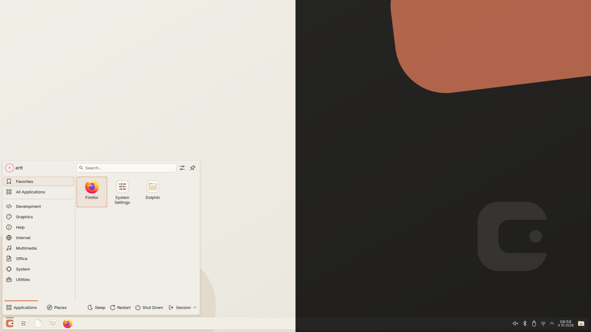
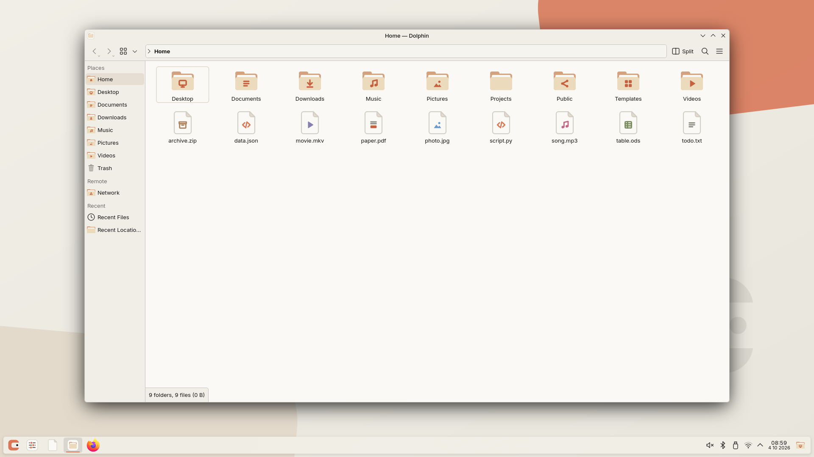
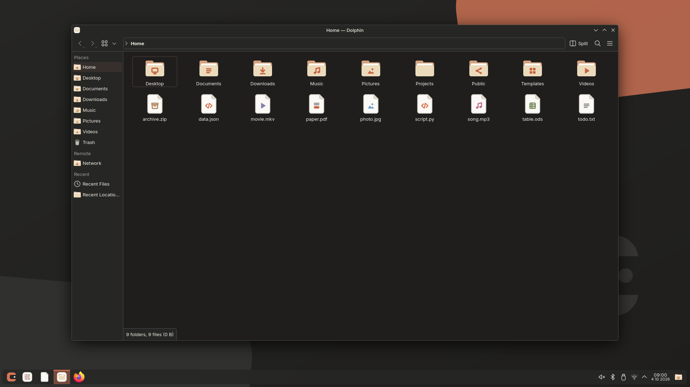
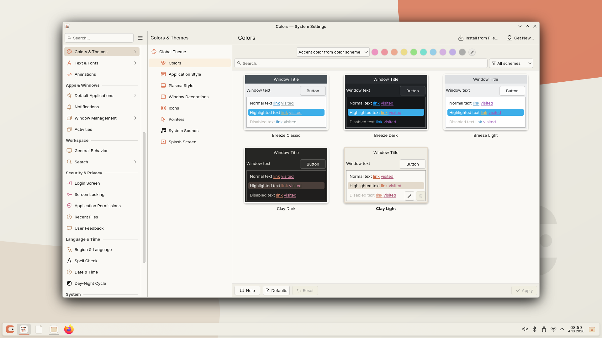
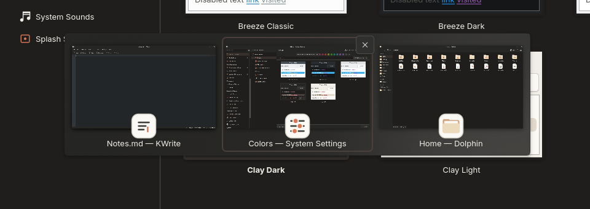
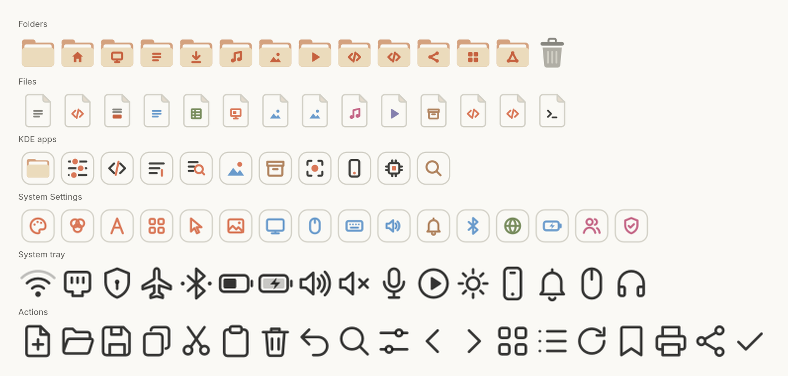
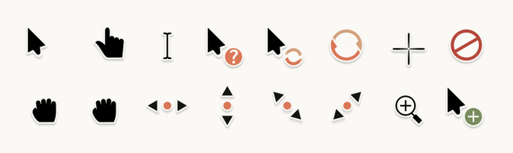

# Clay KDE Theme



Clay — тёплая «бумажная» тема для KDE Plasma 6, светлая и тёмная. Слоновая кость и графит, один сдержанный терракотовый акцент только для фокуса и активных элементов. Единый вид от панели до файлового менеджера: цвета, стиль Plasma, иконки, курсоры, обои, заставка, экран выхода, Alt+Tab.

Версия **1.1.0** · Plasma 6.7+ · [English](README.en.md)

<table>
<tr>
<td></td>
<td></td>
</tr>
<tr>
<td></td>
<td></td>
</tr>
<tr>
<td></td>
<td></td>
</tr>
</table>

## KDE Store

Без скриптов: «Параметры системы → Глобальная тема → Загрузить новые…», поиск «Clay». Global Theme сама скачает стиль Plasma, иконки, курсоры, обои и Alt+Tab, а Clay — ещё и Clay Dark: останется выбрать её тёмной темой в «Глобальная тема» (там же включается переключение на тёмную ночью). Компоненты можно ставить и по отдельности, каждый в своём разделе.

| Компонент | Где в Параметрах | Стор |
|---|---|---|
| Global Theme Clay / Clay Dark | Глобальная тема | [Clay](https://store.kde.org/p/2377208) · [Clay Dark](https://store.kde.org/p/2377211) |
| Стиль Plasma | Стиль Plasma | [Clay](https://store.kde.org/p/2377181) · [Clay Dark](https://store.kde.org/p/2377182) |
| Цветовые схемы | Цвета | [Clay Color Schemes](https://store.kde.org/p/2377202) |
| Иконки | Значки | [Clay Icons](https://store.kde.org/p/2377203) |
| Курсоры | Курсоры | [Clay Cursors](https://store.kde.org/p/2377205) |
| Обои | Обои | [Clay Field](https://store.kde.org/p/2377206) · [Clay Field Dark](https://store.kde.org/p/2377278) |
| Alt+Tab | Переключение окон | [Clay Grid](https://store.kde.org/p/2377207) |

Kate/KWrite-темы, kitty, fastfetch, Inter и экран входа — только через `install.sh` (ниже).

## Состав

- Global Theme: `Clay`, `Clay Dark`
- Color Schemes: `ClayLight`, `ClayDark`
- Plasma Style: `clay`, `clay-dark`
- Icon overlay: `clay-icons` с fallback на Breeze
- Wallpapers: `Clay Field`, `Clay Field Dark`
- Splash: Light/Dark
- Login Screen: Plasma Login Manager (см. ниже)
- Lock Screen: штатный Plasma locker + Clay colors/icons/wallpaper (в Light тёмный текст на светлых обоях)
- Logout/Shutdown screen: Clay Light/Dark
- KWin Alt+Tab: `Clay Grid`
- kitty: Clay Light/Dark, переключаются вместе с Plasma
- fastfetch: конфиг и логотип Arch в стиле Clay (`extras/fastfetch`)
- Clay launcher mark
- Clay app tiles: Dolphin, Параметры системы, Kate, KWrite, Spectacle, Gwenview, Okular, Ark, О системе, KDE Connect, эмодзи
- Clay folders and system icon overrides (включая XDG-папки: Desktop, Pictures, Public и т.д.)
- Clay system tray icons: уведомления, буфер обмена, плеер, громкость, микрофон, Wi‑Fi/Ethernet/мобильная сеть/VPN, режим полёта, Bluetooth, яркость/ночной свет, батарея и профили питания, запрет сна, KDE Connect
- Clay Settings icons: модули «Параметров системы» по группам (Clay, Kraft, Sky, Olive, Fig), значки-наложения Dolphin, экран Meta+P
- Clay action icons: ~90 линейных иконок кнопок и тулбаров (правка, навигация, вид, медиа, диалоги) и категории меню запуска
- Plasma style: панель задач, кнопки и поля ввода со скруглением 6 px
- Cursors: `clay-cursors` — курсоры Breeze в палитре Clay (SVG для Wayland + Xcursor 24/36/48)
- Kate/KWrite: темы подсветки `Clay Light` / `Clay Dark`, переключаются вместе с Plasma
- Typography: Inter, если установлен `inter-font`

## Визуальная система

Палитра — тёплая «бумажная»: бумажный Ivory, Slate-чернила, тёплые нейтральные серые и Clay как скупой акцент.

Light:

- View / Window: Ivory `#FAF9F5` / `#F0EEE6`
- Text: Slate `#141413`, muted `#5E5D59`
- Accent (focus, controls, links): Clay `#D97757` / deep `#C6613F`
- Selection: warm neutral `#E3DACC`

Dark:

- View / Window: `#1F1E1D` / `#262624`
- Text: `#F0EEE6`, muted `#B0AEA5`
- Accent: Clay `#D97757`
- Selection: `#4A3F3A`

Иконки: папки из Manilla `#EBDBBC` на Kraft `#D4A27F` с Clay-глифами; файлы — Ivory-листы с цветным глифом по категории (Sky, Olive, Fig, Kraft, Clay); предметы в тёплом сером; системные приложения — бумажные карточки.

Акцент используется точечно: focus, active controls, glyphs, launcher, OSD. Большие поверхности и selection намеренно нейтральные.

## Требования

Проверено на:

- KDE Plasma 6.7.5
- KWin 6.7.5 / Wayland

Нужны команды:

- `plasma-apply-lookandfeel`
- `plasma-apply-colorscheme`
- `plasma-apply-wallpaperimage`
- `kwriteconfig6`
- `kbuildsycoca6`

Стиль виджетов — штатный Breeze (ставится с Plasma), декорация окон (Aurorae, `tools/gen_aurorae.py`), цвета, иконки, курсоры и Plasma style — Clay. Ничего, кроме Plasma, ставить не нужно.

Рекомендуется шрифт Inter:

```bash
sudo pacman -S inter-font
```

Если Inter установлен, `apply-*.sh` выставляет его как системный шрифт (моноширинный не трогается). Без него тема работает на текущих шрифтах.

## Установка

```bash
./install.sh
```

Установка только копирует файлы в `${XDG_DATA_HOME:-~/.local/share}` и не переключает текущую тему.

Затем:

```bash
./apply-light.sh
# или
./apply-dark.sh
```

## kitty

Если установлен kitty, `install.sh` кладёт `extras/kitty/clay-light.conf` и `clay-dark.conf` в `~/.config/kitty/` как `light-theme.auto.conf`, `dark-theme.auto.conf` и `no-preference-theme.auto.conf`. kitty (≥ 0.38) сам переключает их по светлой/тёмной схеме Plasma — отдельно применять ничего не нужно. Эти файлы перекрывают цвета из `kitty.conf`; чужие `*.auto.conf` сохраняются в бэкап, `uninstall.sh` удаляет только файлы Clay.

## fastfetch

Firefox рисует кнопки окна сам (при GTK-теме Breeze — сплошной круг и розовое закрытие). Если Firefox установлен, `install.sh` кладёт `extras/firefox/userChrome.css` в его профиль по умолчанию и включает `toolkit.legacyUserProfileCustomizations.stylesheets` в `user.js`; нужен перезапуск Firefox. Чужой `userChrome.css` сохраняется в бэкап, `uninstall.sh` удаляет только файлы Clay.

`extras/fastfetch/` — конфиг и логотип Arch в четырёх тонах Clay — Manilla, Kraft, Clay, глубокий Clay (`clay-arch.svg` → `clay-arch.png`). Подписи и заголовок — жирный ANSI `light_red` (Clay), значки — основной цвет текста, рамка и разделитель — `light_black`, поэтому цвета берутся из палитры kitty и переключаются вместе с ней. Конфиг личный, `install.sh` его не ставит:

```bash
cp extras/fastfetch/config.jsonc extras/fastfetch/clay-arch.png ~/.config/fastfetch/
```

Логотип выводится через `kitty-icat` в родном размере PNG, поэтому он отрисован высотой 227 px (≈14 строк при 12 pt): `rsvg-convert -h 227 clay-arch.svg -o clay-arch.png`.

## Экран входа (Plasma Login Manager)

Plasma Login Manager не использует QML-темы, как SDDM: экран входа устроен как экран блокировки и берёт цвета, шрифт и обои из настроек, а стиль Plasma и иконки — только из глобально установленных тем. Clay для него ставится отдельно:

```bash
sudo ./install-login.sh
```

Скрипт кладёт стиль Plasma и иконки Clay в `/usr/local/share` (не пересекается с pacman). Затем в «Параметры системы → Экран входа»:

1. «Настроить внешний вид…» → обои Clay Field (или Clay Field Dark) → «Применить».
2. «Применить настройки Plasma…» → «Применить» — переносит цвета, шрифт Inter, курсор и раскладки.

Оба шага просят пароль администратора. После переключения Light/Dark шаг 2 нужно повторить. Удаление: `sudo ./install-login.sh --remove`.

## Проверка

```bash
./verify.sh
```

## Удаление

```bash
./uninstall.sh
```

Если Clay активен во время удаления, скрипт сначала переключит Plasma на Breeze, чтобы не удалять используемые компоненты.

## Что намеренно не входит

### Overview

Overview остаётся штатным KWin. Он наследует Clay colors/highlight, но ширина рамки выбранного окна в Plasma 6.7 жёстко задана внутри приватного KWin `WindowHeapDelegate.qml` как 6 px. Clay не патчит системные файлы, потому что обновление KWin такой патч перезапишет.

### Panel layout

Global Theme не пересоздаёт панель и не удаляет пользовательские виджеты. На исходной системе Clay используется с floating bottom panel 42 px, но пакет не навязывает этот layout другим пользователям.

## Архитектура

`clay-dark` наследует большую часть SVG от `clay`, поэтому Light/Dark не являются двумя независимыми форками Breeze.

`clay-icons` — overlay-theme с `Inherits=breeze`; собственные файлы есть только для наиболее заметных системных иконок. Полноцветные иконки (папки, файлы, корзина, накопители, карточки приложений) генерируются `tools/gen_icons.py` — правьте генератор, а не SVG. Для файлов генератор берёт список имён из установленного Breeze и раскладывает их по категориям симлинками. Символьные иконки действий (`actions/`) нарисованы вручную. Монохромные иконки системного трея (`status/scalable`) тоже генерируются `tools/gen_icons.py`: Plasma 6 берёт их только из icon theme (`icons/*.svgz` Plasma style не используется), поэтому они лежат здесь, а не в `desktoptheme`.

`Clay Grid` основан на штатном KWin Thumbnail Grid и не меняет логику Alt+Tab, только размер и визуальное выделение.

## Лицензирование

Проект содержит компоненты с разными исходными лицензиями:

- Clay-authored assets используют лицензии, указанные в соответствующих metadata.
- `Clay Grid` производен от KWin Thumbnail Grid; исходные SPDX/GPL-заголовки сохранены.
- Logout QML производен от Breeze Look-and-Feel; исходные SPDX-заголовки сохранены.

См. `LICENSES.md`.
